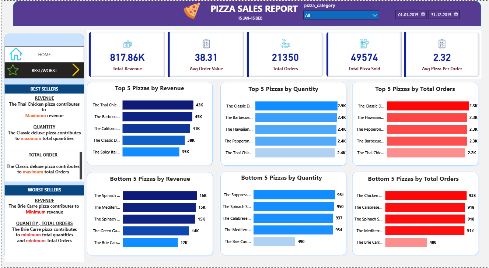

# 🍕 Pizza Sales Analysis (MySQL + Power BI)

## 📌 Project Overview
This project analyzes pizza store sales data using **MySQL** for querying and **Power BI** for building an interactive dashboard.  
The goal is to identify sales trends, best-selling products, and key performance metrics that help in making data-driven decisions.

---

## ⚙️ Tools & Technologies
- **MySQL** → Data cleaning & analysis using SQL queries  
- **Power BI** → Dashboard creation & visualization  
- **Microsoft Word** → Documentation of SQL queries & outputs  

---

## 🔑 Key Business Questions Answered
1. What is the **total revenue, orders, and pizzas sold**?  
2. Which **days and months** have the highest sales?  
3. Which **pizza category & size** contributes most to revenue?  
4. What are the **top 5 and bottom 5 pizzas** by revenue, quantity, and orders?  
5. What is the **average order value** and **average pizzas per order**?  

---

## 📊 Dashboard Overview

### 🔹 Home Page
- Total Revenue: **817.86K**  
- Avg Order Value: **38.31**  
- Total Orders: **21,350**  
- Total Pizzas Sold: **49,574**  
- Daily & Monthly Sales Trends  
- Sales by Pizza Category & Size  

---

### 🔹 Best/Worst Sellers
- **Best Seller by Revenue**: Thai Chicken Pizza  
- **Best Seller by Quantity & Orders**: Classic Deluxe Pizza  
- **Worst Seller by Revenue & Orders**: Brie Carre Pizza  

---

## 📂 Repository Contents
- `pizza_sales_queries.sql` → SQL queries used for analysis  
- `pizza_sales_dashboard.pbix` → Power BI dashboard file  
- `pizza_sales_report.docx` → Queries with outputs  
- `README.md` → Project documentation  

---

## 🚀 Insights & Learnings
- Sales are **highest on weekends (Fri/Sat evenings)**.  
- **July & January** show the peak in monthly orders.  
- **Classic category & Large size pizzas** generate maximum sales.  
- **Brie Carre pizza** performs the worst in both sales & orders.  

---

## 📌 How to Use
1. Open the `pizza_sales_queries.sql` file in MySQL Workbench to run the queries.  
2. Open the `pizza_sales_dashboard.pbix` file in Power BI Desktop to view the dashboard.  

---

✨ This project showcases **SQL + Power BI integration** for end-to-end data analysis and visualization.  

